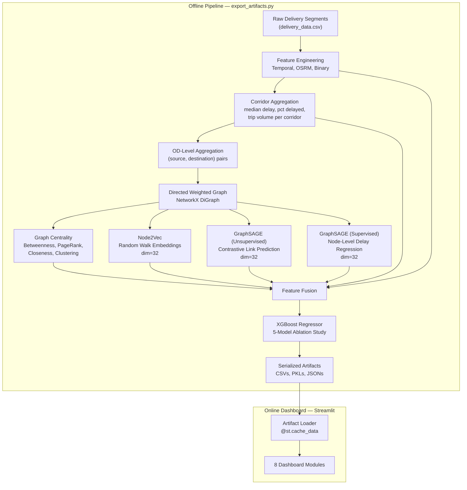

# Graph-Based Logistics ETA System

A graph-structured machine learning system for delivery time estimation across a hub-and-spoke logistics network. The system models the logistics network as a directed graph, computes structural features via centrality analysis and graph representation learning (Node2Vec, GraphSAGE), and fuses these features into an XGBoost regressor to predict segment-level delivery times.

Built for the Delhivery logistics network (~1,800 facilities, ~3,200 corridors, ~144k trip segments).

---

## Table of Contents

- [Problem Statement](#problem-statement)
- [System Architecture](#system-architecture)
- [Data Model](#data-model)
- [Graph Construction](#graph-construction)
- [Graph Analytics](#graph-analytics)
- [Node2Vec Embeddings](#node2vec-embeddings)
- [GraphSAGE Embeddings](#graphsage-embeddings)
- [ETA Prediction Pipeline](#eta-prediction-pipeline)
- [Dashboard Architecture](#dashboard-architecture)
- [Repository Structure](#repository-structure)
- [Environment Setup](#environment-setup)
- [Why Two Requirements Files?](#why-two-requirements-files)
- [Design Decisions](#design-decisions)
- [Future Work](#future-work)

---

## Problem Statement

Delhivery uses OSRM (Open Source Routing Machine) to estimate delivery times. OSRM computes shortest paths on road networks under the assumption of clean traffic and static travel speeds. In practice, actual delivery times deviate from OSRM predictions due to:

- Facility-level dwell time and processing delays
- Congestion at high-throughput hubs
- Route-type constraints (FTL vs. Carting have different operational profiles)
- Time-of-day and day-of-week effects
- Structural bottlenecks where many routes converge through a small number of hubs

The core insight is that these delay factors are **not independent per trip**. A hub that sits on many shortest paths and has high outbound delay propagates that delay to all downstream segments. Standard point-to-point regression models cannot capture this because they treat each trip as an isolated observation.

This system addresses the problem by treating the logistics network as a directed graph and extracting structural, topological, and learned representations of each facility. These representations encode information about a hub's position in the network, its neighborhood's operational health, and its historical delay profile — information that is invisible to flat tabular models.

---

## System Architecture

The system is split into two phases: an **offline pipeline** that trains models and exports artifacts, and an **online dashboard** that loads those artifacts for inference and visualization.



### Offline Pipeline

`export_artifacts.py` is the single entry point for the entire training pipeline. It executes the following stages sequentially:

| Stage | Operation | Output Artifact |
|-------|-----------|-----------------|
| 1–5 | Data loading, cleaning, feature engineering, corridor aggregation | In-memory DataFrames |
| 6 | Directed weighted graph construction from OD-level statistics | In-memory `nx.DiGraph` |
| 7 | Centrality computation + composite bottleneck ranking | `node_df.csv`, `edge_df.csv`, `bottleneck_hubs.csv`, `chronic_corridors.csv` |
| 8a | Node2Vec training (random walks on undirected projection) | `node2vec_embeddings.csv` |
| 8b | Unsupervised GraphSAGE (contrastive loss) | `graphsage_embeddings.csv` |
| 8c | Supervised GraphSAGE (MSE loss on node-level mean delay) | `sup_sage_embeddings.csv` |
| 9 | XGBoost training (5 progressive feature sets) | `best_xgb_model.pkl`, `benchmark_results.csv`, `feature_importance.csv` |
| Meta | Graph metadata and executive summary metrics | `graph_metadata.json`, `executive_metrics.json` |

### Online Dashboard

The Streamlit application performs **zero training**. It reads pre-computed artifacts from the `artifacts/` directory and renders them. Live ETA inference assembles a feature vector from cached embeddings and centrality values, then calls `xgb_model.predict()` on a NumPy array.

---

## Data Model

Each row in the source dataset represents a **segment**: one leg of a multi-leg delivery trip.

### Entities

| Entity | Description | Identifier |
|--------|-------------|------------|
| **Segment** | A single hop from one facility to the next within a trip | Combination of `trip_uuid` + source/destination |
| **Trip** | A complete multi-segment journey from origin to final destination | `trip_uuid` |
| **Facility** | A logistics hub (warehouse, sorting center, delivery station) | `source_center` / `destination_center` |
| **Corridor** | A directed connection between two facilities, optionally stratified by route type and time of day | `source_center` → `destination_center` |

### Key Columns

| Column | Type | Description |
|--------|------|-------------|
| `segment_actual_time` | float | Actual elapsed time for this segment (minutes). **Primary regression target.** |
| `segment_osrm_time` | float | OSRM-predicted travel time (minutes) |
| `segment_osrm_distance` | float | OSRM-estimated road distance (km) |
| `segment_factor` | float | Ratio `actual / osrm`. Values >1.2 are considered delayed. |
| `route_type` | categorical | `FTL` (Full Truckload) or `Carting` (multi-drop) |
| `source_center` / `destination_center` | string | Facility identifiers (become graph nodes) |
| `data` | string | Pre-defined split: `training` or `test` |

### Derived Features

| Feature | Derivation |
|---------|-----------|
| `departure_hour`, `departure_day_of_week` | Extracted from `od_start_time` |
| `hour_sin`, `hour_cos` | Cyclical encoding of departure hour |
| `is_night_shipment` | Binary: hour < 6 or hour ≥ 22 |
| `is_weekend` | Binary: day_of_week ≥ 5 |
| `is_delayed` | Binary: `segment_factor` > 1.2 (the SLA breach threshold) |
| `osrm_speed_kmh` | `segment_osrm_distance / (segment_osrm_time / 60)` |
| `corridor_id` | `source_center + "_" + destination_center + "_" + route_type` |

### Corridor-Level Aggregation

Corridor statistics are computed **on the training set only** to prevent data leakage:

```python
corridor_stats = df_train.groupby("corridor_id").agg(
    corridor_median_delay = ("segment_factor", "median"),
    corridor_mean_delay   = ("segment_factor", "mean"),
    corridor_delay_std    = ("segment_factor", "std"),
    corridor_trip_volume  = ("trip_uuid", "nunique"),
    corridor_pct_delayed  = ("is_delayed", "mean"),
)
```

These are joined to both train and test sets. Unseen corridors in the test set receive the global training median as a fallback.

---

## Graph Construction

### Node and Edge Definitions

- **Nodes**: Each unique `source_center` or `destination_center` facility becomes a node.
- **Edges**: Directed edges connect each observed (source → destination) pair.

### Edge Attributes

Edges carry six attributes aggregated at the OD-pair level from the training data:

| Attribute | Description |
|-----------|-------------|
| `weight` | Median delay ratio (`segment_factor`) for this corridor |
| `mean_delay` | Mean delay ratio |
| `delay_std` | Standard deviation of delay ratio |
| `pct_delayed` | Fraction of trips with `segment_factor` > 1.2 |
| `trip_volume` | Number of unique trips traversing this corridor |
| `avg_minutes` | Mean actual travel time (minutes) |

### Why a Directed Graph

The graph is directed (`nx.DiGraph`) because logistics corridors are asymmetric:

- A hub may be a major **origination point** (high out-degree) but receive few inbound shipments (low in-degree).
- Delay characteristics differ by direction. The corridor A→B may have a median delay of 1.4× while B→A is 1.0×.
- PageRank and SLA breach scores depend on direction. Outbound breach score captures how much delay a hub *generates*; inbound breach score captures how much delay a hub *receives*.

An undirected projection (`G.to_undirected()`) is used only where the algorithm requires it (betweenness, closeness, clustering, Node2Vec).

### Weighting Scheme

Edge `weight` is set to the **median delay ratio** (`segment_factor`). This was chosen over mean because delay distributions are right-skewed — a small number of extreme delays can inflate the mean, while the median captures the typical operational experience on that corridor.

---

## Graph Analytics

Ten node-level metrics are computed and stored per facility. Each metric captures a different aspect of a hub's structural or operational role.

### Structural Metrics

| Metric | Computation | Operational Meaning |
|--------|------------|---------------------|
| **In-degree** | `G.in_degree()` | Number of distinct corridors feeding into this hub. High values indicate consolidation points. |
| **Out-degree** | `G.out_degree()` | Number of distinct corridors originating from this hub. High values indicate distribution points. |
| **Weighted in-degree** | `G.in_degree(weight="trip_volume")` | Total inbound trip volume. Captures actual throughput, not just connectivity. |
| **Weighted out-degree** | `G.out_degree(weight="trip_volume")` | Total outbound trip volume. |
| **Betweenness centrality** | `nx.betweenness_centrality(G_und, weight="weight")` | Fraction of shortest-delay paths passing through this hub. High betweenness hubs are structural chokepoints — their failure or degradation disrupts many routes. |
| **Closeness centrality** | `nx.closeness_centrality(G_und, distance="weight")` | Inverse of the average shortest-delay distance to all other hubs. High closeness indicates a hub can reach most of the network with minimal delay. |
| **PageRank** | `nx.pagerank(G, weight="trip_volume", alpha=0.85)` | Recursive importance: a hub is important if it receives traffic from other important hubs. Weighted by trip volume. |
| **Clustering coefficient** | `nx.clustering(G_und, weight="weight")` | Density of connections among a hub's neighbors. High clustering means neighbors are well-connected to each other, providing alternate routing options. Low clustering means the hub is an unavoidable bottleneck. |

### Operational Metrics

| Metric | Formula | Operational Meaning |
|--------|---------|---------------------|
| **SLA breach score** | `Σ (pct_delayed × trip_volume)` over all outgoing edges | Volume-weighted delay contribution. A hub with 60% delayed trips on a 500-trip corridor scores higher than one with 90% delayed trips on a 10-trip corridor. |
| **Inbound breach score** | `Σ (pct_delayed × trip_volume)` over all incoming edges | How much delayed traffic arrives at this hub from upstream. Distinguishes hubs that *cause* delays from hubs that *receive* them. |

### Composite Bottleneck Rank

A weighted percentile rank combining structural risk and operational pain:

```python
bottleneck_rank = (
    betweenness.rank(pct=True) * 0.40 +
    sla_breach_score.rank(pct=True) * 0.35 +
    pagerank.rank(pct=True) * 0.15 +
    inbound_breach_score.rank(pct=True) * 0.10
)
```

The 40/35/15/10 weighting reflects a preference for hubs that are both structurally critical (betweenness) and operationally problematic (SLA breach). PageRank adds recursive importance. Inbound breach provides a secondary signal about upstream dependency.

### Edge-Level Analysis

Edge betweenness centrality identifies corridors that lie on many shortest-delay paths. **Chronic corridors** are defined as edges where `median_delay > 1.2` (the SLA breach threshold) and `trip_volume >= 5` (excludes noise from low-traffic corridors).

---

## Node2Vec Embeddings

[Node2Vec](https://arxiv.org/abs/1607.00653) generates dense vector representations of nodes by learning from biased random walks on the graph.

### Configuration

| Parameter | Value | Rationale |
|-----------|-------|-----------|
| `dimensions` | 32 | Embedding dimensionality. 32 is sufficient for a graph of ~1,800 nodes without overfitting. |
| `walk_length` | 30 | Each random walk visits 30 nodes. Long enough to capture multi-hop structure. |
| `num_walks` | 80 | 80 walks initiated per node. Provides sampling density for stable embeddings. |
| `p` | 1.0 | Return parameter. `p=1` provides moderate tendency to revisit the previous node. |
| `q` | 0.5 | In-out parameter. `q < 1` biases walks towards exploring the neighborhood (BFS-like), capturing local community structure. |
| `window` | 5 | Skip-gram window size for the Word2Vec training objective. |

### Role in the Pipeline

Node2Vec operates on the **undirected projection** of the graph. It captures topological proximity — hubs that share similar neighborhoods receive similar embeddings — but it does not use any node features (centrality, delay statistics). It serves as a structural baseline for the embedding ablation study.

For each trip, the source and destination Node2Vec vectors are concatenated into the feature vector. An additional `cos_sim_n2v` feature computes the cosine similarity between the source and destination embeddings, capturing how "topologically close" the two facilities are.

---

## GraphSAGE Embeddings

[GraphSAGE](https://arxiv.org/abs/1706.02216) (SAmple and aggreGatE) is an inductive graph neural network that generates embeddings by aggregating features from a node's local neighborhood via learned aggregation functions.

### Why GraphSAGE over GCN and GAT

| Model | Limitation in this context |
|-------|---------------------------|
| **GCN** (Graph Convolutional Network) | Transductive — requires the full graph at inference time. Cannot generalize to new nodes. Uses spectral convolutions tied to the specific graph Laplacian. |
| **GAT** (Graph Attention Network) | Attention weights add parameters and computational overhead. On this graph (~1,800 nodes), the attention mechanism provides marginal benefit over mean aggregation, while increasing training instability. |
| **GraphSAGE** | Inductive — learns a generalizable aggregation function, not node-specific weights. Mean aggregation is stable and interpretable. Supports variable-size neighborhoods. Well-suited for operational graphs where facilities may be added or removed. |

### Architecture

Two variants are trained:

#### Unsupervised GraphSAGE

```
Input Features (10-dim: centrality metrics)
    → StandardScaler
    → SAGEConv(10 → 64, aggr="mean") → ReLU → Dropout(0.2)
    → SAGEConv(64 → 32, aggr="mean")
    → 32-dim embedding
```

**Training objective**: Contrastive link prediction. Positive pairs are sampled from existing edges; negative pairs are sampled uniformly at random. The loss is:

```python
loss = -log(σ(z_src · z_dst))  -  log(σ(-z_neg_src · z_neg_dst))
```

Trained for 150 epochs with Adam (lr=0.01), using 2,048 positive and 2,048 negative samples per batch.

#### Supervised GraphSAGE

```
Input Features (10-dim: centrality metrics)
    → StandardScaler
    → SAGEConv(10 → 64, aggr="mean") → ReLU → Dropout(0.3)
    → SAGEConv(64 → 32, aggr="mean")
    → Linear(32 → 1)
    → Predicted mean delay per node
```

**Training objective**: MSE loss on z-normalized node-level mean `segment_actual_time`. Targets are computed from the training set: `df_train.groupby("source_center")["segment_actual_time"].mean()`.

Trained for 200 epochs with Adam (lr=0.005, weight_decay=1e-4).

The supervised variant produces embeddings that are explicitly aligned with the delay prediction task. The intermediate 32-dim embedding (before the linear head) is extracted and used as features.

### Input Features to GraphSAGE

Both variants receive the same 10-dimensional input feature vector per node, constructed from the centrality metrics computed in the graph analytics stage:

```
[betweenness, closeness, pagerank, clustering,
 in_degree, out_degree, weighted_in, weighted_out,
 sla_breach_score, inbound_breach_score]
```

These are standardized (zero mean, unit variance) before being passed to the model.

### Message Passing

GraphSAGE's mean aggregation operates as follows for a 2-layer network:

1. **Layer 1**: Each node aggregates the input features of its immediate neighbors via mean pooling, concatenates with its own features, and passes through a learned linear transformation + ReLU.
2. **Layer 2**: Each node repeats the aggregation, this time over the Layer 1 representations of its neighbors. This gives each node a **2-hop receptive field**.

The result is that each facility's embedding encodes not just its own centrality profile, but the aggregated operational health of all facilities within two hops.

---

## ETA Prediction Pipeline

### Feature Groups

The XGBoost regressor receives a concatenation of six feature groups:

| Group | Features | Count |
|-------|----------|-------|
| **OSRM features** | `segment_osrm_time`, `segment_osrm_distance`, `osrm_speed_kmh` | 3 |
| **Temporal features** | `departure_hour`, `hour_sin`, `hour_cos`, `is_weekend`, `is_night_shipment`, `departure_day_of_week` | 6 |
| **Corridor statistics** | `corridor_median_delay`, `corridor_mean_delay`, `corridor_delay_std`, `corridor_trip_volume`, `corridor_pct_delayed` | 5 |
| **Operational features** | `route_type_encoded`, `cutoff_factor`, `is_cutoff` | 3 |
| **Source + Destination centrality** | `src_{metric}`, `dst_{metric}` for each of 10 centrality metrics | 20 |
| **Source + Destination Node2Vec** | `src_n2v_{0..31}`, `dst_n2v_{0..31}`, `cos_sim_n2v` | 65 |
| **Source + Destination GraphSAGE (unsup)** | `src_sage_{0..31}`, `dst_sage_{0..31}`, `cos_sim_sage` | 65 |
| **Source + Destination GraphSAGE (sup)** | `src_sup_sage_{0..31}`, `dst_sup_sage_{0..31}`, `cos_sim_sup_sage` | 65 |

The cosine similarity features (`cos_sim_*`) measure the angular similarity between source and destination embeddings in each embedding space, providing a scalar summary of how similar the two facilities are from the perspective of each representation.

### XGBoost Configuration

```python
XGBRegressor(
    n_estimators=400,
    max_depth=6,
    learning_rate=0.05,
    subsample=0.9,
    colsample_bytree=0.9,
    random_state=42,
    n_jobs=-1
)
```

### Ablation Study (5-Model Progressive Benchmark)

Five models are trained with identical XGBoost hyperparameters but progressively expanded feature sets:

| Model | Feature Set |
|-------|------------|
| **Baseline** | OSRM + Temporal + Corridor + Operational |
| **+ Centrality** | Baseline + 20 source/destination centrality features |
| **+ Centrality + Node2Vec** | Previous + 65 Node2Vec features |
| **+ Centrality + N2V + GraphSAGE (unsup)** | Previous + 65 unsupervised GraphSAGE features |
| **+ Cent + N2V + SAGE + SupervisedSAGE** | Previous + 65 supervised GraphSAGE features |

This progressive structure isolates the marginal contribution of each representation layer. The final model (with all features) is serialized as `best_xgb_model.pkl`.

### Evaluation Metrics

- **MAE** (Mean Absolute Error): Primary regression metric.
- **RMSE** (Root Mean Squared Error): Penalizes large errors.
- **R²**: Coefficient of determination.
- **Within-15%**: Percentage of predictions where `|predicted - actual| / actual ≤ 0.15`. This is the business-critical SLA metric.

### Inference Flow

At inference time (e.g., in the dashboard's ETA Prediction Engine):

1. User selects source hub, destination hub, departure hour, day of week, and route type.
2. OSRM features are provided (or defaulted).
3. Centrality metrics are looked up from `node_df.csv` for both source and destination.
4. Node2Vec, unsupervised GraphSAGE, and supervised GraphSAGE embeddings are looked up from their respective CSV files.
5. Cosine similarities are computed dynamically between source and destination embeddings.
6. All features are assembled into a NumPy array **in the exact column order** specified by `feature_importance.csv`.
7. `xgb_model.predict(array)` returns the estimated delivery time in minutes.

> **Implementation note**: The XGBoost model was trained on raw NumPy arrays without column names. It does not have the `feature_names_in_` attribute. Inference must pass a 2D NumPy array, not a Pandas DataFrame, and the column order must exactly match the training order.

---

## Dashboard Architecture

### Offline–Online Separation

The dashboard performs no model training, no graph construction, and no centrality computation. All computation-heavy work is done by `export_artifacts.py`, which writes 12 artifacts to the `artifacts/` directory.

### Caching Strategy

All artifact loading is cached via Streamlit decorators:

- `@st.cache_data`: Used for CSVs and JSON files. Data is serialized and shared across sessions.
- `@st.cache_resource`: Used for the XGBoost model (`joblib.load`). The model object is loaded once and shared across all users.

The `utils/data_loader.py` module provides centralized loaders:

```python
load_csv(filename)       # → pd.DataFrame (cached)
load_json(filename)      # → dict (cached)
load_xgb_model(filename) # → xgb.XGBRegressor (cached as resource)
load_graph()             # → nx.DiGraph reconstructed from node_df + edge_df (cached)
```

### Dashboard Modules

| Page | Purpose |
|------|---------|
| **Executive Overview** | KPI cards (facilities, corridors, SLA breach rate), model performance summary, upgrade simulation |
| **Network Explorer** | Interactive ego-network visualization (Plotly). Select a hub, view 1-hop predecessors and successors with spring layout. |
| **Bottleneck Intelligence** | Scatter plot of betweenness centrality vs. SLA breach score. Chronic corridor table. Intervention framework. |
| **Graph Embeddings Lab** | Side-by-side t-SNE projections of Node2Vec, unsupervised GraphSAGE, and supervised GraphSAGE embeddings, colored by bottleneck rank. |
| **ETA Prediction Engine** | Live inference. User selects source/destination/hour/day/route type → model returns predicted ETA. |
| **Model Benchmarks** | Ablation study table + waterfall chart showing MAE reduction across the 5-model progression. |
| **Model Explainability** | Top-N feature importance bar chart (from XGBoost `feature_importances_`), grouped by feature category. |
| **Technical Architecture** | Pipeline diagram and model specifications. |

---

## Repository Structure

```
.
├── Notebook/
│   ├── Optimizing_ETA_with_GBI (1).ipynb    # Jupyter notebook: full EDA, graph construction,
│   │                                         #   model training, and visualization
│   └── optimizing_eta_with_gbi.py           # Auto-exported Python script of the notebook
│
├── dashboard/
│   ├── app.py                               # Streamlit entry point and sidebar
│   ├── export_artifacts.py                  # Offline pipeline: data → graph → embeddings
│   │                                         #   → XGBoost → serialized artifacts
│   ├── requirements.txt                     # Dashboard/serving dependencies (lightweight)
│   ├── requirements-train.txt               # Training pipeline dependencies (PyTorch, PyG, Node2Vec)
│   ├── delivery_data.csv                    # Source dataset (~42 MB)
│   ├── AI_CONTEXT.md                        # Development guidelines for contributors
│   │
│   ├── artifacts/                           # Generated by export_artifacts.py (gitignored)
│   │   ├── node_df.csv                      # Node-level centrality + bottleneck rank
│   │   ├── edge_df.csv                      # Edge-level betweenness + delay stats
│   │   ├── bottleneck_hubs.csv              # Top 50 hubs by composite bottleneck rank
│   │   ├── chronic_corridors.csv            # Corridors with median_delay > 1.2x
│   │   ├── node2vec_embeddings.csv          # 32-dim Node2Vec vectors per hub
│   │   ├── graphsage_embeddings.csv         # 32-dim unsupervised GraphSAGE vectors
│   │   ├── sup_sage_embeddings.csv          # 32-dim supervised GraphSAGE vectors
│   │   ├── best_xgb_model.pkl              # Serialized XGBoost model (full feature set)
│   │   ├── benchmark_results.csv            # 5-model ablation metrics
│   │   ├── feature_importance.csv           # Per-feature importance + category labels
│   │   ├── graph_metadata.json              # Node/edge counts, embedding dim
│   │   └── executive_metrics.json           # Summary KPIs for dashboard
│   │
│   ├── components/
│   │   ├── aesthetics.py                    # Global CSS injection (dark theme, Inter font)
│   │   ├── charts.py                        # Plotly chart builders (waterfall, bar, t-SNE)
│   │   └── metrics_cards.py                 # HTML metric card and badge renderers
│   │
│   ├── utils/
│   │   └── data_loader.py                   # Cached artifact loaders
│   │
│   └── pages/
│       ├── 1_Executive_Overview.py
│       ├── 2_Network_Explorer.py
│       ├── 3_Bottleneck_Intelligence.py
│       ├── 4_Graph_Embeddings_Lab.py
│       ├── 5_ETA_Prediction_Engine.py
│       ├── 6_Model_Benchmarks.py
│       ├── 7_Model_Explainability.py
│       └── 8_Technical_Architecture.py
│
└── README.md
```

### Directory Responsibilities

| Directory | Role |
|-----------|------|
| `Notebook/` | Exploratory development. Contains the full research notebook with EDA, visualizations, and iterative model development. Not part of the production pipeline. |
| `dashboard/` | Production system. `export_artifacts.py` is the batch pipeline; `app.py` + `pages/` is the serving layer. |
| `dashboard/artifacts/` | Artifact store. All files are generated, never hand-edited. Regenerated by running `export_artifacts.py`. |
| `dashboard/components/` | Reusable UI primitives. No business logic. |
| `dashboard/utils/` | Data access layer. All artifact I/O goes through `data_loader.py`. |

---

## Environment Setup

The project maintains two separate dependency manifests to decouple the training pipeline from the serving layer.

### Prerequisites

- Python 3.8+
- CUDA-capable GPU (optional; GraphSAGE trains on CPU in ~2 minutes for this graph size)

```bash
git clone <repository-url>
cd graph-based-logistics-intelligence

python -m venv venv
# Windows
venv\Scripts\activate
# macOS / Linux
source venv/bin/activate
```

### Training Environment

Used for:

- Node2Vec training (biased random walks + Word2Vec)
- GraphSAGE training (unsupervised contrastive + supervised MSE)
- XGBoost training (5-model ablation study)
- Artifact generation (serialized CSVs, PKLs, JSONs)

#### Installation

```bash
pip install -r dashboard/requirements-train.txt
```

#### Dependencies

```
pandas>=1.5.0
numpy>=1.23.0
networkx>=3.0
node2vec>=0.4.6
torch>=2.0.0
torch-geometric>=2.3.0
xgboost>=1.7.0
scikit-learn>=1.2.0
matplotlib>=3.6.0
seaborn>=0.12.0
joblib>=1.3.0
```

#### Data Preparation

Place `delivery_data.csv` in the `dashboard/` directory. The dataset should contain the pre-defined `training` / `test` split in the `data` column.

#### Execution

```bash
python dashboard/export_artifacts.py
```

This generates the following artifacts in `dashboard/artifacts/`:

| Artifact | Contents |
|----------|----------|
| `benchmark_results.csv` | 5-model ablation study metrics (MAE, RMSE, R², Within-15%) |
| `node_df.csv` | Node-level centrality metrics and composite bottleneck rank |
| `edge_df.csv` | Edge-level betweenness centrality and delay statistics |
| `node2vec_embeddings.csv` | 32-dim Node2Vec vectors per facility |
| `graphsage_embeddings.csv` | 32-dim unsupervised GraphSAGE vectors per facility |
| `feature_importance.csv` | Per-feature importance scores with category labels |
| `best_xgb_model.pkl` | Serialized XGBoost model (full feature set) |
| `executive_metrics.json` | Summary KPIs for the dashboard executive overview |

Additional artifacts (`bottleneck_hubs.csv`, `chronic_corridors.csv`, `sup_sage_embeddings.csv`, `graph_metadata.json`) are also generated. Expected runtime: 5–10 minutes on CPU.

---

### Dashboard Environment

Used only for inference and visualization. The dashboard loads precomputed artifacts from `dashboard/artifacts/` and does **not** retrain any models.

#### Installation

```bash
pip install -r dashboard/requirements.txt
```

#### Dependencies

```
pandas>=1.5.0
numpy>=1.23.0
networkx>=3.0
xgboost>=1.7.0
scikit-learn>=1.2.0
streamlit>=1.28.0
plotly>=5.15.0
joblib>=1.3.0
matplotlib>=3.6.0
seaborn>=0.12.0
```

Note: `torch`, `torch-geometric`, and `node2vec` are **not** required for the dashboard. The serving layer only needs XGBoost for `model.predict()` and NetworkX for graph reconstruction from cached node/edge DataFrames.

#### Execution

```bash
streamlit run dashboard/app.py
```

The application will be available at `http://localhost:8501`.

---

## Why Two Requirements Files?

Training dependencies (`torch`, `torch-geometric`, `node2vec`) are large, have complex build chains (CUDA, C++ extensions), and are expensive to install. The dashboard does not execute any training code — it loads precomputed embeddings from CSVs and runs inference through a serialized XGBoost model.

Separating the two environments provides three concrete benefits:

1. **Deployment reliability**: The production dashboard installs in seconds with pure-Python wheels. No PyTorch compilation, no CUDA version conflicts, no platform-specific `torch-geometric` builds.
2. **Smaller attack surface**: Production containers carry only the packages they execute. Training-only dependencies (random walk samplers, GNN layers) are absent from the serving image.
3. **Independent lifecycle management**: Training environments can pin to specific PyTorch/PyG versions for reproducibility, while the dashboard can upgrade Streamlit or Plotly independently without risking training regressions.

This follows standard MLOps practice: train offline, serialize artifacts, serve with a minimal runtime.

---

## Design Decisions

### Why NetworkX

NetworkX is used for graph construction and centrality computation. Alternatives considered:

- **graph-tool**: Faster for large graphs due to C++ backend, but has complex installation (requires compilation) and limited Windows support. NetworkX is pure Python, pip-installable, and sufficient for a graph of ~1,800 nodes.
- **igraph**: Faster than NetworkX for centrality, but the API is index-based rather than label-based. Since facility IDs are strings, NetworkX's label-based API reduces boilerplate.

For production systems with 100k+ nodes, a migration to graph-tool or a distributed framework (e.g., DGL) would be warranted.

### Why Node2Vec

Node2Vec provides a lightweight, unsupervised structural embedding that requires no feature engineering at the node level. Its random-walk approach captures topological similarity without supervision. It serves two purposes:

1. **Structural baseline**: Measures how much predictive value comes from graph topology alone, before adding message-passing representations.
2. **Complementary signal**: The BFS-biased walks (q=0.5) capture local community structure that may not be fully captured by GraphSAGE's fixed 2-hop aggregation.

### Why GraphSAGE

GraphSAGE was chosen as the primary graph neural network because:

1. **Inductive capability**: Learns a generalizable aggregation function, not node-specific parameters. If new facilities are added to the network, their embeddings can be computed without retraining.
2. **Feature integration**: Unlike Node2Vec, GraphSAGE uses node features (centrality metrics) as inputs and propagates them through the neighborhood. This means the embedding encodes both the facility's own operational profile and its neighbors'.
3. **Simplicity**: Mean aggregation is parameter-efficient and stable. On a graph of this size, the added complexity of attention (GAT) or spectral methods (GCN) does not yield meaningful gains.
4. **Dual-objective training**: The unsupervised variant captures general structural patterns; the supervised variant directly optimizes for delay prediction. Having both provides the downstream XGBoost model with complementary representations.

### Why XGBoost

The final prediction is made by XGBoost rather than by the GNN itself because:

1. **Heterogeneous feature fusion**: XGBoost natively handles the concatenation of diverse feature types (continuous OSRM features, binary temporal features, dense embeddings, sparse centrality metrics) without requiring normalization or architecture changes.
2. **Interpretability**: Feature importances from XGBoost directly show which embedding dimensions and centrality features drive predictions. This is critical for a system that needs to provide actionable insights to operations teams.
3. **Training efficiency**: XGBoost trains in seconds on the assembled feature matrix. The graph representations are pre-computed; XGBoost only needs to learn the relationship between the fused features and delivery time.
4. **Proven reliability**: For tabular prediction tasks with mixed feature types, gradient-boosted trees consistently outperform end-to-end neural approaches.

### Why Offline–Online Architecture

The system separates training from serving because:

1. **Latency**: Graph centrality computation, random walks, and GNN training are expensive. The dashboard must render in sub-second time.
2. **Reproducibility**: Artifacts are deterministic outputs of `export_artifacts.py`. Any dashboard bug can be debugged against fixed artifacts without retraining.
3. **Decoupling**: The pipeline can be rerun on new data (e.g., weekly batch updates) without modifying the dashboard code. The dashboard only needs to know the artifact schema.

---

## Future Work

- **Graph Attention Networks (GAT)**: Replace mean aggregation with learned attention weights to let the model focus on the most delay-relevant neighbors. Likely to help in dense subgraphs where some neighbors are healthy and others are bottlenecks.
- **Temporal Graph Networks**: The current system treats the graph as static. In practice, corridor delay ratios change with time of day, day of week, and season. Temporal GNNs (e.g., TGN, TGAT) could model these dynamics by encoding edge timestamps.
- **Dynamic graph updates**: Support incremental graph updates when new corridors are observed or existing corridors change characteristics, without full pipeline retraining.
- **Real-time ETA inference**: Replace the batch artifact pipeline with a streaming architecture where graph features are updated in near-real-time from incoming shipment scans.
- **Live corridor monitoring**: Extend the dashboard to display real-time delay risk scores per corridor, enabling proactive rerouting before SLA breaches occur.
- **Multi-hop path ETA**: Currently, each segment is predicted independently. A path-level model could predict the total ETA for a multi-segment trip by composing segment-level predictions with hub dwell time estimates.
